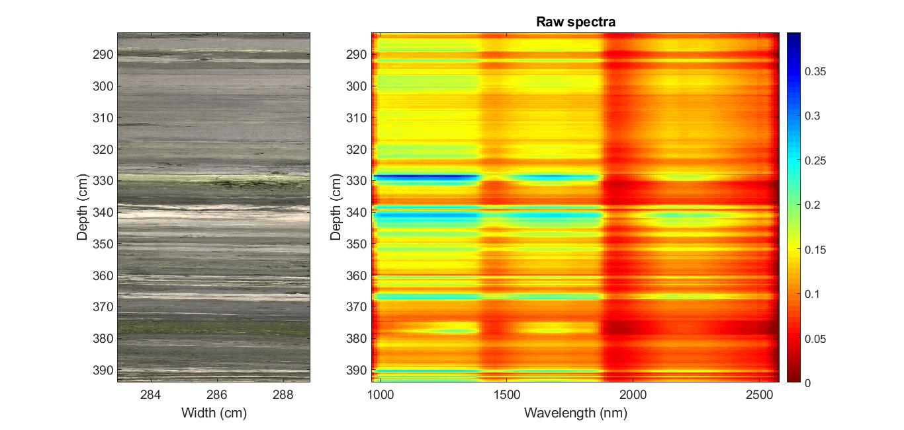
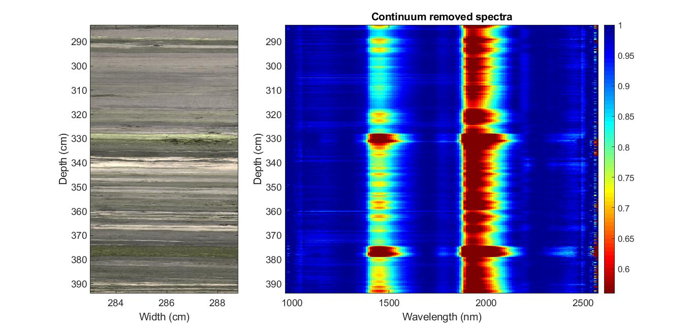
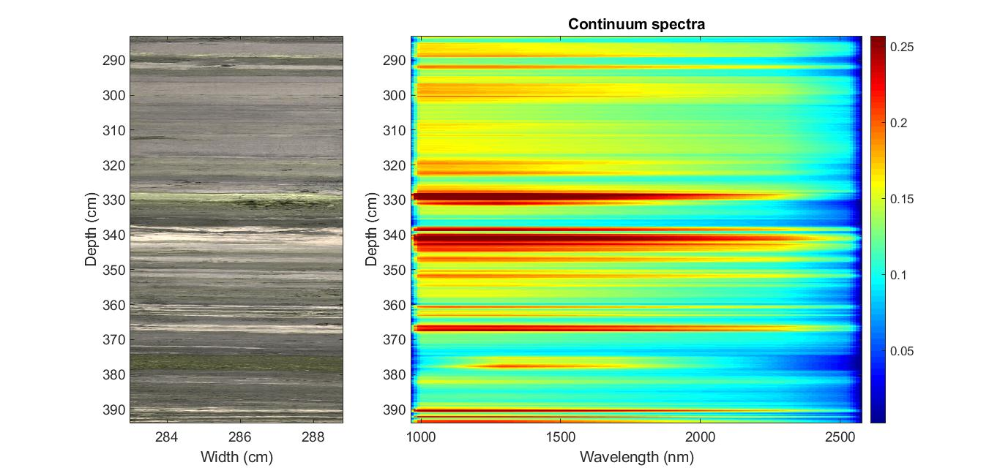
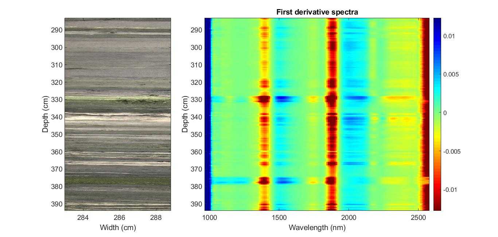
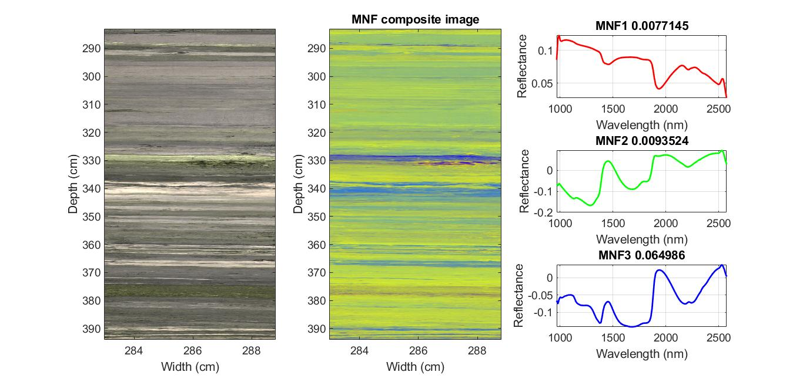
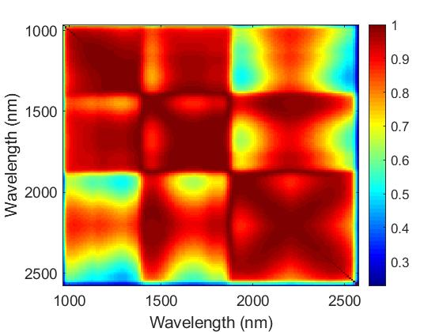

# Toolbox
The mandatory data to use this toolbox are a hyperspectral image (M), the corresponding RGB image (RGB), depth (dm), and wavelength (wl). Then, the toolbox will estimate continuum, first derivative of the HSI.

## Visualization

## Median raw spectra
<center></center>

## Median continuum removed spectra
<center></center>

```markdown
Clark, R.N. (1999) Spectroscopy of Rocks and Minerals, and Principles of Spectroscopy. In: Rencz, A. N. (ed.) Remote Sensing for the Earth Sciences: Manual of Remote Sensing, 3 Ed. John Wiley & Sons, Inc., 1–50.
```

## Median continuum spectra
<center></center>

## Median first derivative spectra
<center></center>

```markdown
Savitzky, A., Golay, M.J.E. (1964) Smoothing and Differentiation of Data by Simplified Least Squares Procedures. Analytical Chemistry 36: 1627–1639
```

## Minimum Noise Fraction image composite
<center></center>

```markdown
Green, A.A., Berman, M., Switzer, P., Craig, M.D. (1988) A Transformation for Ordering Multispectral Data in Terms of Image Quality with Implications for Noise Removal. IEEE Transactions on Geoscience and Remote Sensing 26: 65–74
```

## Wavelength correlations
<center></center>